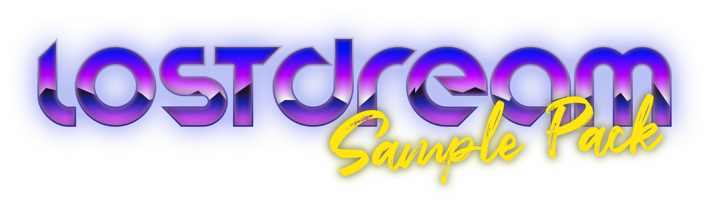

# LostDream

A samplepack made by JXQU3!

**DOWNLOAD:**  

My YouTube: https://www.youtube.com/@JXQU3
My Spotify: https://open.spotify.com/artist/2pdUGHioFEsL9VTCCaYt03

## Contents
This sample pack includes:
- Drum Loops
- Drum One-shots
- Melodies
- Midi Melodies
- Synth One-Shots
- Recorded One-Shots
- Effects

Most sounds are really dry (no/little reverb/delay, etc...) to allow you to add your own effects.

# License
You are able to use the samples for anything for free!
If you modify the sample pack and want to publish your modification, feel free to do it, but it should be **free** and have the **same license** as this one!

As for the example songs, they have the Creative Commons Attribution 4.0 license